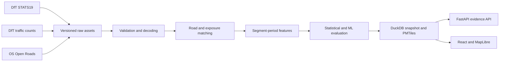

# Architecture

RoadSafe UK separates annual batch computation from read-only application
serving.

The browser receives national vector geometry from static PMTiles. FastAPI
serves segment profiles, comparisons, metadata, investigation state, and
reports. Models are scored in batch; map interaction does not invoke training
or online inference.

The exposure pipeline uses British National Grid (`EPSG:27700`) for metric
matching and WGS84 (`EPSG:4326`) for API geometry. Collision-to-link matches,
segment evidence, GeoJSON serving artifacts, and a network quality report are
written separately so rejected matches remain auditable.
