# Architecture

RoadSafe UK separates annual batch computation from read-only application
serving.

```mermaid
flowchart LR
    DFT[DfT STATS19] --> ACQUIRE[Atomic acquisition and validation]
    TRAFFIC[DfT traffic counts] --> ACQUIRE
    ACQUIRE --> MANIFEST[Checksums and provenance manifests]
    MANIFEST --> RAW[Versioned raw assets]
    OS[OS Open Roads] --> RAW
    RAW --> VALIDATE[Validation and decoding]
    VALIDATE --> MATCH[Road and exposure matching]
    MATCH --> FEATURES[Annual segment evidence]
    FEATURES --> PANEL[Validated segment-year panel]
    PANEL --> GATE[Contract readiness gate]
    GATE --> MODELS[Statistical and ML evaluation]
    MODELS --> PUBLISH[DuckDB snapshot and PMTiles]
    PUBLISH --> API[FastAPI evidence API]
    PUBLISH --> WEB[React and MapLibre]
```

The browser receives national vector geometry from static PMTiles. FastAPI
serves segment profiles, comparisons, metadata, investigation state, and
reports. Models are scored in batch; map interaction does not invoke training
or online inference.

The exposure pipeline uses British National Grid (`EPSG:27700`) for metric
matching and WGS84 (`EPSG:4326`) for API geometry. Collision-to-link matches,
segment evidence, GeoJSON serving artifacts, and a network quality report are
written separately so rejected matches remain auditable.

Annual serving identifiers retain the source year and geometry version. The
panel additionally uses `dft-count-point-{id}` as a stable analytical key,
because DfT defines the count point as the road-link reference shared by AADF
and the Major Roads Database. The panel never assumes geometry is unchanged:
the annual `segment_id` and `source_year` remain alongside the stable key.

Panel construction is separate from model fitting. It validates annual schema,
year consistency, segment-year uniqueness, checksums, exposure, targets, and
the subgroup fields declared in the evaluation contract. A blocked report is
a valid artifact; no model output is promoted while blockers remain.
